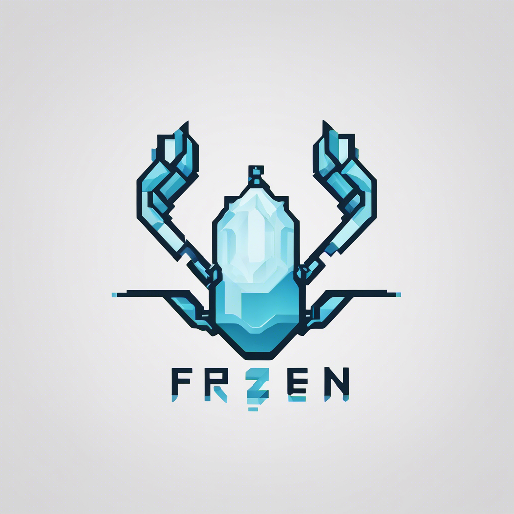

# Frozen Shrimp (WIP)

<div style="text-align: center;">
    
    <div><small>Generated by: <a href="https://stability.ai/stable-diffusion" target="_blank">Stability AI Stable Diffusion XL</a></small></div>
</div>

## Project Decisions and Implementation Notes

### Overview

These are the decisions I made during the development process:

- I began by installing a base Laravel project and then connected Docker containers to run the project. Following that, I searched for a suitable and efficient scrapper/parser for the project and concluded that the Symfony Crawler could be an excellent choice.

- After installing the Laravel commands, I immediately delved into prototyping the scrapper and parser. My initial focus was on acquiring and parsing data into a usable format.

- While exploring the website to determine how to navigate without using a specific address in the HTML request, I discovered that there were no specific links or forms. However, I observed a cookie (salepoint) changing when the address was changed. I successfully made requests by altering that cookie to obtain the correct products.

- Once the prototype was complete, I proceeded to refactor the code, emphasizing readability and understanding with Domain Driven Design in mind. I created entities, services, specs, and value objects.

- I introduced the following interfaces:
    - `CategoryCrawlerServiceInterface` to define the service interface responsible for crawling the category of products.
    - `CategoryParserServiceInterface` to define the service interface responsible for parsing products from the HTML.

- After completing the initial iteration of the crawler and parser, I focused on creating data models.

- I decided to establish a category and products table in the database, along with repositories for them. Category data consists of name, slug, URL, and a hash. The hash serves as a sorting caching mechanism to prevent unnecessary updates to the database if the data remains the same. The hash is generated from the sorted content of the product to ensure determinism. Product data includes name, price, image, and URL, as specified in the task.

- Abstracted away the laravel eloquent Models into entities. to disallow the magic methods and to have a more explicit object.

- I modified the commands to utilize the services and repositories, incorporating logic to save the data to the database.

- To display the product list using the URL, it is only necessary to fetch the category and list products by category ID.

- I introduced a simple hasher/hashable interface (utilizing SHA-1 for simplicity) to generate the hash of the category product content.

- Additional steps included adding PHPStan and PHP-CS-Fixer to the project to enhance code quality and readability.

- I created basic unit and integration tests for the services and repositories, also implementing a "main" Service to encapsulate the business logic of the commands.

- Finally, I added GitHub Actions to run tests upon pushing to the master branch and to create a container with the project for easy command execution.

### Commands used (non-exhaustive list):

```bash
$ docker compose -f ./compose/local/compose.yaml up -d --build
$ docker exec -it frozen-shrimp-php-1 sh
# inside the php container
$ composer install
$ composer require symfony/dom-crawler symfony/http-client cocur/slugify
$ composer require --dev friendsofphp/php-cs-fixer larastan/larastan
$ php artisan make:command SaveProductList
$ php artisan make:command ShowProductList
$ php artisan make:migration create_category_table
$ php artisan make:migration create_products_table
$ php artisan migrate
# and for testing the commands
$ php artisan save-product-list {URL}
$ php artisan show-product-list {URL}
```

### Testing

I used the following commands to run the tests:

```bash
# within the php container 
$ php artisan test
```

### File structure

```text
.
└── Carrefour
    ├── CategoryCrawlerService.php
    ├── CategoryCrawlerServiceInterface.php
    ├── CategoryEloquentRepository.php
    ├── CategoryParserService.php
    ├── CategoryParserServiceInterface.php
    ├── CategoryRepositoryInterface.php
    ├── CategoryService.php
    ├── CategoryServiceInterface.php
    ├── Entities
    │   ├── Category.php
    │   └── Product.php
    ├── ProductEloquentRepository.php
    ├── ProductRepositoryInterface.php
    ├── ServiceProvider.php
    ├── Specs
    │   ├── CategoryCrawlInput.php
    │   ├── CategoryCrawlOutput.php
    │   ├── CategoryProductParserInput.php
    │   ├── CategoryProductParserOutput.php
    │   ├── SaveProductListInput.php
    │   ├── SaveProductListOutput.php
    │   ├── ShowProductListInput.php
    │   └── ShowProductListOutput.php
    └── ValueObjects
        └── CrawlCategoryProduct.php
```

### Limitations

- Error handling, I would have created appropriate exception to manage errors for each service .
- Zero logging. I would have implemented logging as a decorator for the services following the onion architecture like [go-kit](https://github.com/go-kit/examples/blob/master/profilesvc/middlewares.go#L11) does.
